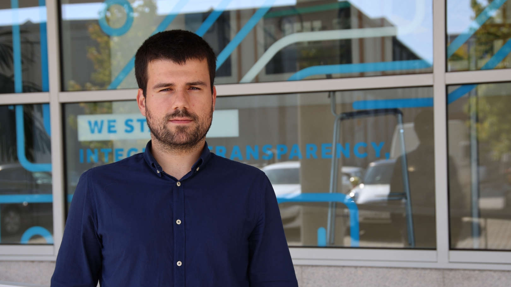

# Ricardo B. Sousa Personal Webpage

## Identifiers

- CiênciaVITAE: [D11E-2C67-1CCE](https://www.cienciavitae.pt/D11E-2C67-1CCE)
- ORCiD: [0000-0003-4537-5095](https://orcid.org/0000-0003-4537-5095)
- AuthenticusID: [R-00J-JZZ](https://www.authenticus.pt/R-00J-JZZ)
- Google Scholar: [Bz2FMqYAAAAJ](https://scholar.google.com/citations?user=Bz2FMqYAAAAJ)
- Researcher ID: [AAG-9201-2021](https://www.webofscience.com/wos/author/record/AAG-9201-2021)
- Scopus Author ID: [56561955600](https://www.scopus.com/authid/detail.uri?authorId=56561955600)

## Links

- [@sousarbarb](https://github.com/sousarbarb) _(GitHub)_
- [@sousarbarb](https://gitlab.com/sousarbarb) _(GitLab)_
- [@ricardo.b.sousa](https://gitlab.inesctec.pt/ricardo.b.sousa)
  _(GitLab INESC TEC)_
- [LinkedIn](https://www.linkedin.com/in/sousa-ricardob/)
- [ResearchGate](https://www.researchgate.net/profile/Ricardo-Sousa-19)
- [YouTube](https://www.youtube.com/channel/UCXTR8mMlG0VOC_06PKg5KBQ)

## Contacts

**Ricardo Barbosa Sousa**

Robotics Researcher at
[CRIIS - Centre for Robotics in Industry and Intelligent Systems](https://www.inesctec.pt/en/centres/criis/) from
[INESC TEC - Institute for Systems and Computer Engineering, Technology and Science](https://www.inesctec.pt/en/),
4200-465 Porto, Portugal

- Mail: [ricardo.b.sousa@inesctec.pt](mailto:ricardo.b.sousa@inesctec.pt)
- Tel.: [+351 220 413 317](tel:+351220413317)

PhD Candidate in Electrical and Computers Engineering (ECE) at the
[Faculty of Engineering, University of Porto (FEUP)](https://sigarra.up.pt/feup/en/),
4200-465 Porto, Portugal

Researcher at the
[5dpo Robotics Team](https://5dpo.github.io/), 4200-465 Porto, Portugal

- Mail: [up201503004@edu.fe.up.pt](mailto:up201503004@edu.fe.up.pt)
