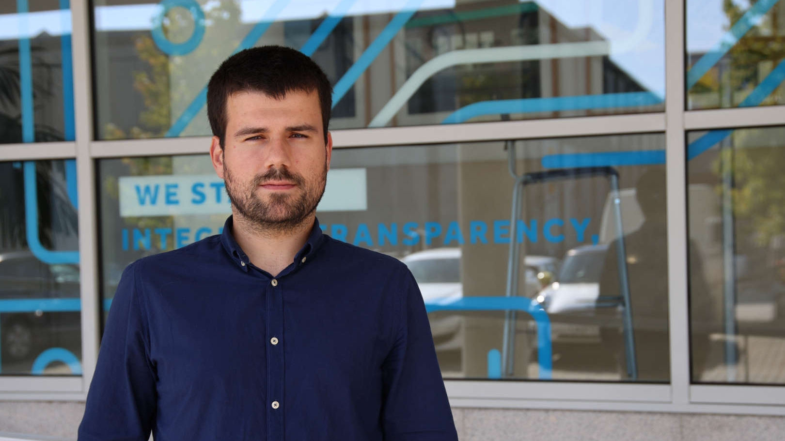

# Ricardo B. Sousa Personal Webpage

**Robotics Researcher | Autonomous Mobile Robots | Research to Industrial Deployment**

Robotics researcher who takes Simultaneous Localization and Mapping (SLAM)
algorithms and navigation stacks for Autonomous Mobile Robots (AMRs) from the
research prototype stage to the factory floor.
Creator of the RicoSLAM framework
([https://github.com/INESCTEC/ricoslam](https://github.com/INESCTEC/ricoslam)).
Deployment of SLAM algorithms and autonomous navigation stacks on-site at
5+ companies and several industrial sites.
Built research mobile robotic platforms and contributed to the
_IILABS 3D — iilab Indoor LiDAR-based SLAM_ dataset (DOI:
[10.1109/ACCESS.2025.3643753](https://doi.org/10.1109/ACCESS.2025.3643753)).
Author of 16 peer-reviewed publications (5 journal, 11 conference), including
a Best Paper Award.

## Identifiers

- CiênciaVITAE: [D11E-2C67-1CCE](https://www.cienciavitae.pt/D11E-2C67-1CCE)
- ORCiD: [0000-0003-4537-5095](https://orcid.org/0000-0003-4537-5095)
- AuthenticusID: [R-00J-JZZ](https://www.authenticus.pt/R-00J-JZZ)
- Google Scholar: [Bz2FMqYAAAAJ](https://scholar.google.com/citations?user=Bz2FMqYAAAAJ)
- Researcher ID: [AAG-9201-2021](https://www.webofscience.com/wos/author/record/AAG-9201-2021)
- Scopus Author ID: [56561955600](https://www.scopus.com/authid/detail.uri?authorId=56561955600)

## Links

- [@sousarbarb](https://github.com/sousarbarb) _(GitHub)_
- [@sousarbarb](https://gitlab.com/sousarbarb) _(GitLab)_
- [@ricardo.b.sousa](https://gitlab.inesctec.pt/ricardo.b.sousa)
  _(GitLab INESC TEC)_
- [LinkedIn](https://www.linkedin.com/in/sousa-ricardob/)
- [ResearchGate](https://www.researchgate.net/profile/Ricardo-Sousa-19)
- [YouTube](https://www.youtube.com/channel/UCXTR8mMlG0VOC_06PKg5KBQ)

## Contacts

**Ricardo Barbosa Sousa**

Robotics Researcher at
[CRIIS - Centre for Robotics in Industry and Intelligent Systems](https://www.inesctec.pt/en/centres/criis/) from
[INESC TEC - Institute for Systems and Computer Engineering, Technology and Science](https://www.inesctec.pt/en/),
4200-465 Porto, Portugal

- Mail: [ricardo.b.sousa@inesctec.pt](mailto:ricardo.b.sousa@inesctec.pt)
- Tel.: [+351 220 413 317](tel:+351220413317)

PhD Candidate in Electrical and Computers Engineering (ECE) at the
[Faculty of Engineering, University of Porto (FEUP)](https://sigarra.up.pt/feup/en/),
4200-465 Porto, Portugal

- Mail: [up201503004@edu.fe.up.pt](mailto:up201503004@edu.fe.up.pt), [rbs@fe.up.pt](mailto:rbs@fe.up.pt)
