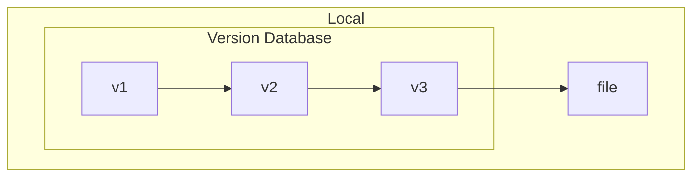
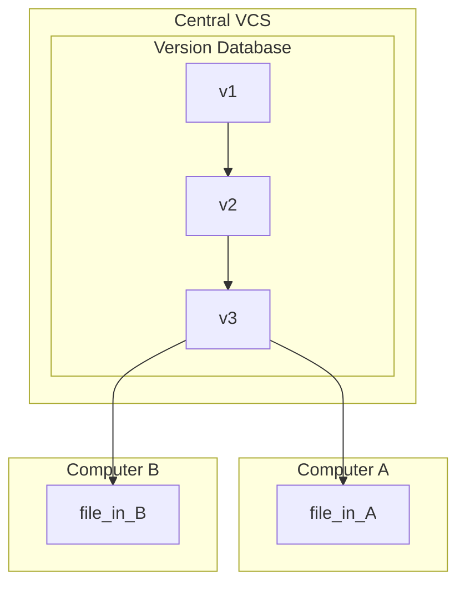
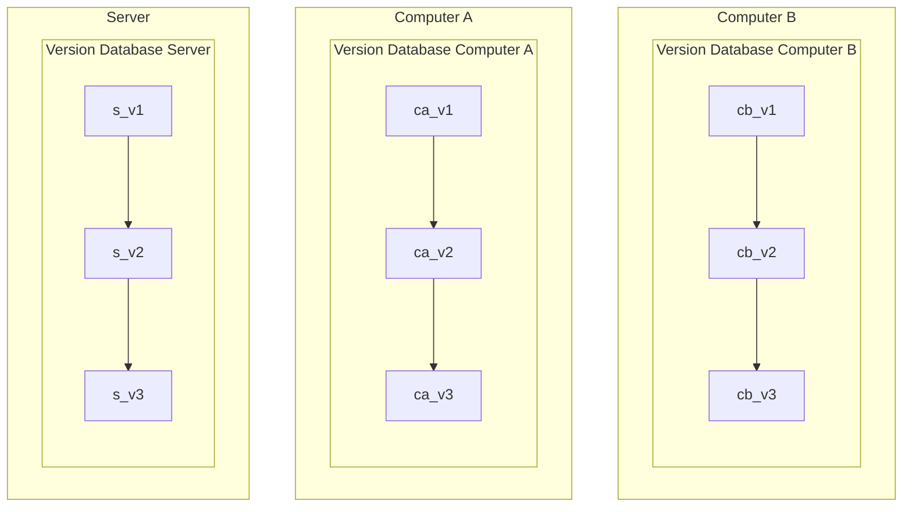

# Git

## Getting Started

### Installation

```sh
sudo apt update
sudo apt dist-upgrade

sudo apt install git

git --version
git --help
```

### GUI Clients

- [GitKraken](https://www.gitkraken.com/)
- [Git source control in VS Code](https://code.visualstudio.com/docs/sourcecontrol/overview)

_Note:_ personally, I prefer to use the Command-Line Interface (CLI) of git, to
better understand how the workflow of managing git repositories work. Still,
GUI clients can be of great help to visualise the Git branch tree, manage
tags/submodules, while giving a more graphic perspective of the
repositories' state.

### Useful links

- [Git](https://git-scm.com/)
- [Pro Git book](https://git-scm.com/book/en/v2)
- Git Cheat Sheet
    - [GitHub](https://education.github.com/git-cheat-sheet-education.pdf)
    - [GitLab](https://about.gitlab.com/images/press/git-cheat-sheet.pdf)
    - [Atlassian](https://www.atlassian.com/git/tutorials/atlassian-git-cheatsheet)
    - _Note:_ does not matter by which git cheat sheet you follow, but either of
      them are a very quick way to known the main git CLI commands and the
      respective usage
- Agile Git
    - [How to use GitLab for Agile software development (GitLab)](https://about.gitlab.com/blog/2018/03/05/gitlab-for-agile-software-development/)
    - [Agile Git branching strategies in 2023 (Medium)](https://medium.com/@amid.ukr/agile-git-branching-strategies-in-2023-caeead79ddd)
    - [Learn how Git fits into an agile workflow (Atlassian)](https://www.atlassian.com/agile/software-development/git)
- [Open Source Guides](https://opensource.guide/)
- Tutorials
    - [Git by André Restivo](https://web.fe.up.pt/~arestivo/slides/?s=git)
    - [Hello World](https://docs.github.com/en/get-started/start-your-journey/hello-world)
    - [Getting Git Right (Atlassian)](https://www.atlassian.com/git/)
    - Interactive Learning
        - [Learn Git Branching](https://learngitbranching.js.org/)
        - [Visualizing Git](https://git-school.github.io/visualizing-git/)

## Version Control System (VCS)

- VCS allows to:
    - Record changes made to a file(s) over time
    - Revert selected files / entire project back to a previous state
    - Compare changes between versions
    - See who modified something
    - ...
- **Source Control Management (SCM):** track modifications made to a source code
  repository
    - Track all changes made to a project over time
    - Detailed historical record of the project

### Local VCS

- Simple database that keeps all the changes to files under revision control
- Version management of all files only within the local system (no remote
  server)
- Most local VCSs store only the difference patches between files instead of
  copies of each version
  (then, they can recreate any file at any point in time by adding up all the
  patches)
- _Examples:_
  [Revision Control System (RCS)](https://www.gnu.org/software/rcs/),
  [Source Code Control System (SCCS)](https://www.ibm.com/docs/en/aix/7.2?topic=concepts-source-code-control-system)



### Centralised VCS

- Single server that contains all the versioned files
- Users checkout a particular version of the files from the central place
- Advantages:
    - Everyone knows what everyone is doing (offers full visibility into what
      code is currently worked on)
    - Fine-grained control over who can do what
    - Easier to administer a CVCS compared to local databases
- Disadvantages:
    - Single point of failure
    - Requires constant connectivity
        - If the server is down, nobody can collaborate at all or save versioned
          changes
        - Slow speed delays development (difficult time branching the version
          tree and dealing with merge conflicts)
    - Backups are mandatory (if storage of the central database becomes corrupt
      without any backups, entire history of the project would be lose, except
      for whatever single snapshots people happen to have in their local
      machines)
- _Examples:_
  [Concurrent Versions System (CVS)](https://cvs.nongnu.org/),
  [Subversion](https://subversion.apache.org/),
  [Perforce](https://www.perforce.com/)



### Distributed VCS

- All clients fully mirror the repository, including its full history
    - If any server dies, any of the client repositories can be copied back to
      the server to restore it
    - Every clone is a full backup of all the data
- No difference between a server and a client (but one or more computers can be
  used as a central point of synchronisation)
- Allows lots of different workflows
    - Work well with having several remote repositories they can work with
    - E.g., hierarchical model of repositories
- _Examples:_
  [Git](https://git-scm.com/),
  [Mercurial](https://www.mercurial-scm.org/),
  [Bazaar](https://www.gnu.org/software/bazaar/),
  [BitKeeper](https://www.bitkeeper.org/),
  [Darcs](https://darcs.net/),
  [Fossil](https://www.fossil-scm.org/home/doc/trunk/www/index.wiki)



## Final Notes

- Commit often
    - Each commit is a snapshot that the codebase can be reverted to
    - Frequent commits offer more opportunities to revert or undo work
    - Group of commits can be combined into a single commit using a rebase
      to clarify the development log
- Ensure that you are working with the latest version
  (multiple developers, each one with its local copy of the codebase)
- Make detailed notes
- Review changes before committing
  (staging area can be used to manage and review the changes before doing a
  commit)
- Use branches
    - Enable multiple developers to work in parallel on separate lines of
      development
    - When development is completed on a branch, then can be merged into the
      main line of development
- Agree on a workflow
    - Most VCSs / SCMs are agnostic to the methods of contribution
    - Teams must establish shared patterns of collaboration
