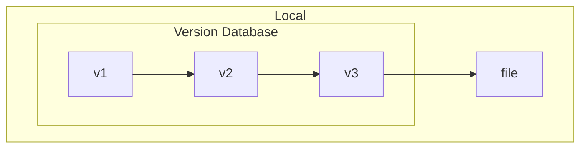
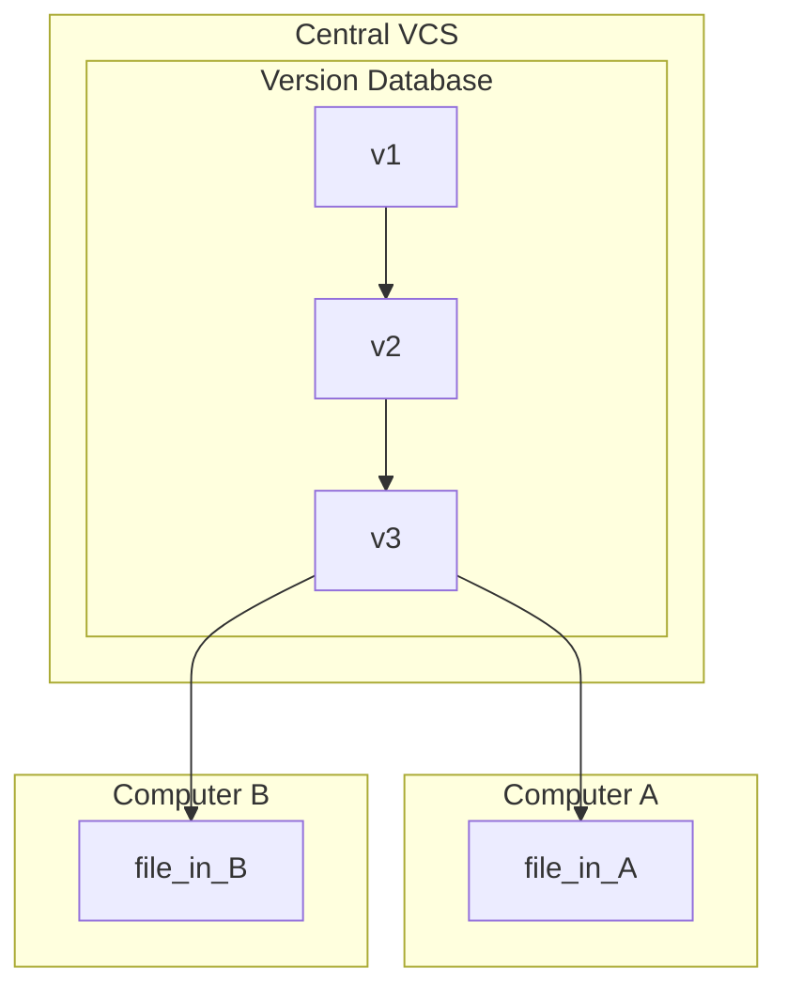
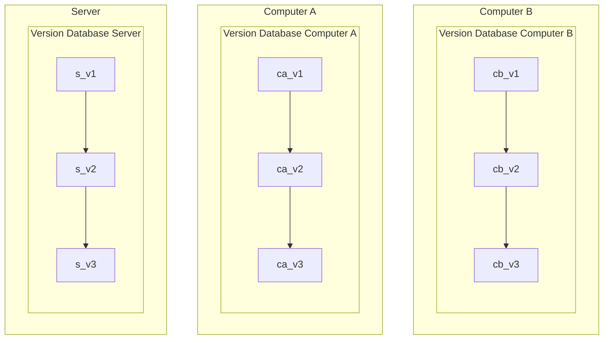

# Git

## Getting Started

### Installation

```sh
sudo apt update
sudo apt dist-upgrade

sudo apt install git

git --version
git --help
```

### GUI Clients

- [GitKraken](https://www.gitkraken.com/)
- [Git source control in VS Code](https://code.visualstudio.com/docs/sourcecontrol/overview)

_Note:_ personally, I prefer to use the Command-Line Interface (CLI) of git, to
better understand how the workflow of managing git repositories work. Still,
GUI clients can be of great help to visualise the Git branch tree, manage
tags/submodules, while giving a more graphic perspective of the
repositories' state.

### Useful Links

- [Git](https://git-scm.com/)
- [Pro Git book](https://git-scm.com/book/en/v2)
- Git Cheat Sheet
    - [GitHub](https://education.github.com/git-cheat-sheet-education.pdf)
    - [GitLab](https://about.gitlab.com/images/press/git-cheat-sheet.pdf)
    - [Atlassian](https://www.atlassian.com/git/tutorials/atlassian-git-cheatsheet)
    - _Note:_ does not matter by which git cheat sheet you follow, but either of
      them are a very quick way to known the main git CLI commands and the
      respective usage
- Agile Git
    - [How to use GitLab for Agile software development (GitLab)](https://about.gitlab.com/blog/2018/03/05/gitlab-for-agile-software-development/)
    - [Agile Git branching strategies in 2023 (Medium)](https://medium.com/@amid.ukr/agile-git-branching-strategies-in-2023-caeead79ddd)
    - [Learn how Git fits into an agile workflow (Atlassian)](https://www.atlassian.com/agile/software-development/git)
- [Open Source Guides](https://opensource.guide/)
- Tutorials
    - [Git by André Restivo](https://web.fe.up.pt/~arestivo/slides/?s=git)
    - [Hello World](https://docs.github.com/en/get-started/start-your-journey/hello-world)
    - [Getting Git Right (Atlassian)](https://www.atlassian.com/git/)
    - Interactive Learning
        - [Learn Git Branching](https://learngitbranching.js.org/)
        - [Visualizing Git](https://git-school.github.io/visualizing-git/)

## Version Control System (VCS)

- VCS allows to:
    - Record changes made to a file(s) over time
    - Revert selected files / entire project back to a previous state
    - Compare changes between versions
    - See who modified something
    - ...
- **Source Control Management (SCM):** track modifications made to a source code
  repository
    - Track all changes made to a project over time
    - Detailed historical record of the project

### Local VCS

- Simple database that keeps all the changes to files under revision control
- Version management of all files only within the local system (no remote
  server)
- Most local VCSs store only the difference patches between files instead of
  copies of each version
  (then, they can recreate any file at any point in time by adding up all the
  patches)
- _Examples:_
  [Revision Control System (RCS)](https://www.gnu.org/software/rcs/),
  [Source Code Control System (SCCS)](https://www.ibm.com/docs/en/aix/7.2?topic=concepts-source-code-control-system)



### Centralised VCS

- Single server that contains all the versioned files
- Users checkout a particular version of the files from the central place
- Advantages:
    - Everyone knows what everyone is doing (offers full visibility into what
      code is currently worked on)
    - Fine-grained control over who can do what
    - Easier to administer a CVCS compared to local databases
- Disadvantages:
    - Single point of failure
    - Requires constant connectivity
        - If the server is down, nobody can collaborate at all or save versioned
          changes
        - Slow speed delays development (difficult time branching the version
          tree and dealing with merge conflicts)
    - Backups are mandatory (if storage of the central database becomes corrupt
      without any backups, entire history of the project would be lose, except
      for whatever single snapshots people happen to have in their local
      machines)
- _Examples:_
  [Concurrent Versions System (CVS)](https://cvs.nongnu.org/),
  [Subversion](https://subversion.apache.org/),
  [Perforce](https://www.perforce.com/)



### Distributed VCS

- All clients fully mirror the repository, including its full history
    - If any server dies, any of the client repositories can be copied back to
      the server to restore it
    - Every clone is a full backup of all the data
- No difference between a server and a client (but one or more computers can be
  used as a central point of synchronisation)
- Allows lots of different workflows
    - Work well with having several remote repositories they can work with
    - E.g., hierarchical model of repositories
- _Examples:_
  [Git](https://git-scm.com/),
  [Mercurial](https://www.mercurial-scm.org/),
  [Bazaar](https://www.gnu.org/software/bazaar/),
  [BitKeeper](https://www.bitkeeper.org/),
  [Darcs](https://darcs.net/),
  [Fossil](https://www.fossil-scm.org/home/doc/trunk/www/index.wiki)



## Git Basics

- **Snapshots, Not Differences**
    - Most other VCS systems store information as a list of file-based changes
      (aka, delta-based version control)
    - Git thinks of its data as a series of snapshots of a miniature filesystem
        - Every time you commit, Git basically takes a picture of what all the
          files look like at that moment and stores a reference to that snapshot
        - In order to be efficient, Git does not store the file again if its
          contents have not changed, only saves a link to the previous identical
          file it has already stored
- **Nearly Every Operation is Local**
    - Browsing the repository history
    - Commit changes to the repository locally, then upload them to the remote
      server when possible
- **Data Integrity**
    - Everything in Git is checksummed before it is stored using SHA-1 hashes
    - Git stores everything in its database not by file name but by the hash
      value / checksum of its contents
    - _Example:_ `c9962192f9a359d450cebab57752bdf75003a532`
      (contents of the file `.git/refs/heads/main` that represents the current
      commit of the repository)

### Git Areas

- **Working directory:** directory in the local file system that is associated
  with a Git repository
- **Staging area:** index file, generally contained in the Git directory, that
  stores information about what will go into the next commit
- **`.git` directory** _(repository)_ **:**
  directory inside the working repository

### File States

- **Untracked:** files that exist in the working directory but has not been
  added to the repository's database
- **Modified:** changed files but not yet committed to the repository's database
- **Staged:** modified files marked to go into the next commit snapshot
- **Committed:** data safely stored in the local database

### Basic Git Workflow

1. Checkout the project (`.git` >>> Working directory)
2. Modify the files in your work tree
3. Stage just the changes you want to be part of the next commit, adding only
   those changes to the staging area (Working directory >>> Staging area)
4. Commit the staged files and store the corresponding snapshot permanently to
   your Git directory (Staging area >>> `.git`)

## Git Setup

### Local Configuration

- `git config` sets the configuration variables that control all aspects of how
  Git works:
    - `[path]/etc/gitconfig` (applicable to every user on the system and all
      repositories)
    - `~/.gitconfig` or `~/.config/git/config` (values specific to the user)
    - `[repository path]/.git/config` (configuration specific to the local
      repository)
    - View all settings and where they are comming from using:
      `git config --list --show-origin`

```sh
git config --global user.name "John Doe"
git config --global user.email johndoe@example.com
git config --global core.editor vim
git config --global merge.tool vimdiff
```

### SSH Keys

Nowadays, most of Git remote servers, such as [GitHub](https://github.com/) or
[GitLab](https://gitlab.com/), require SSH keys for authentication, enabling
remote Git operations over SSH.

```sh
ssh-keygen -t ed25519 -C "johndoe@exaxmple.com" -f ~/.ssh/github  # create SSH key
eval $(ssh-agent -s)                                              # start ssh-agent
ssh-add ~/.ssh/github                                             # add SSH private key to the ssh-agent
cat ~/.ssh/github.pub | xclip -selection clipboard                # copy the public key and add to your account
```

Usually, only one SSH key is need to use in the different Git remote servers.
However, if you need to use multiple SSH keys and have problems with the
authentication, you can create an SSH config file as follows:

```sh
touch ~/ssh/config && vim ~/ssh/config
```

**SSH client configuration file**

```
Host GitHub github.com
  HostName github.com
  IdentityFile ~/.ssh/GitHub
  User sousarbarb

Host GitLab gitlab.com
  HostName gitlab.com
  IdentityFile ~/.ssh/GitLab
  User sousarbarb

Host GitLabINESCTEC gitlab.inesctec.pt
  HostName gitlab.inesctec.pt
  IdentityFile ~/.ssh/GitLabINESCTEC
  User ricardo.b.sousa
```

See the
[How To Configure Custom Connection Options for your SSH Client](https://www.digitalocean.com/community/tutorials/how-to-configure-custom-connection-options-for-your-ssh-client)
tutorial for further information on this topic.

## Git Local

### Create a Repository

This creates an empty Git repository, basically a new subdirectory named `.git`
that contains all necessary files to have a Git repository.

```sh
mkdir myproject && cd myproject
git init
git checkout -b main
```

### Add

Add content from the working directory into the staging area (or "index") for
the next commit.

```sh
echo "Hello World to Git" > README
cat README

git status
git add README  # or --all flag to stage all untracked OR modified files
git status
```

Also, you can add directories (`git add doc/`),
specific files (`git add README CONTRIBUTING`), and
use wildcards (`git add src/*.cpp`).

```sh
# Open and edit again the README file in several lines
vim README

# Exexcute the git add --interactive mode to stage specific patches
git add --patch
```

### Commit

Make a commit, capturing a snapshot of the project's currently staged changes,
while associating to the commit a log message.

```sh
git status --short
git commit -m "First commit"
```

If you use `git commit`, Git opens your local code editor set in `core.editor`
configuration variable to add a short message and a longer one.
Additionally, you can stage and commit modified files (that are already tracked
by the Git database) automatically using `git commit -a -m "<log message>"`.

### History

We can see by whom and when each commit was made, the commit message, and also
the SHA-1 hash of each commit. Note that the author information is identified
by the information set by the corresponding user with the `git config` command.

```sh
git log                   # commit history of the repository
git log --oneline         # simplified history
git log --oneline -1      # limit number of entries
git log -1 -p             # show the difference introduced in each commit
git log --stat            # see some abbreviated stats for each commit
git log --pretty=oneline  # prints each commit on a single line
```

### Show Changes

Show changes between the working directory and the index or the repository tree.

```sh
vim README

git diff

git add README
git diff --staged
```

You can also see the changes between branches, between commits, among other
possibilities.

### Undoing Things

- Add some files possibly forgotten from the last commit, or if the commit
  message was messed up
  ```sh
  git add REAME
  git commit -m "Update README"
  git add README
  git commit --amend
  ```
- Unstaging a staged file
  ```sh
  git restore --staged <file>
  git reset HEAD <file>
  ```
- Unmodifying a modified file
  ```sh
  git restore <file>
  git checkout -- <file>
  ```

## Branching

- A branch in Git is simply a movable point to a commit
- Each time you commit to a branch, the pointer moves forward automatically
- `HEAD` is a special pointer that always points to the current branch

### Create Branches

```sh
git branch devel    # create a new devel branch
git branch          # list current branches
git checkout devel  # switch from current branch to devel

# OR
git checkout -b devel   # create and checkout the new branch

git branch
git status
git log
```

### Deleting Branches

```sh
git branch -d devel   # only deletes the branch pointer, all commits remain
```

### Merging

```sh
git checkout main
git merge devel
```

- Git uses two main strategies to merge branches:
    - **Fast-forward merge:** when there is no divergent work
    - **Three-way merge:** when there is diverging work

#### Basic Merge Conflicts

Occasionally, the merge proccess does not go smoothly, if the same part of the
same file was changed differently in the two branches that will be merged.
Thus, in this specific case, Git does not create automatically a new merge
commit. Instead, you may need to edit manually the conflicted file(s):

```sh
$ git status
On branch main
You have unmerged paths.
  (fix conflicts and run "git commit")

Unmerged paths:
  (use "git add <file>..." to mark resolution)

    both modified:      index.html

no changes added to commit (use "git add" and/or "git commit -a")
```

- File modified by Git upon the detection of a merge conflict:
  ```html
  <<<<<<< HEAD:index.html
  <div id="footer">contact : email.support@github.com</div>
  =======
  <div id="footer">
  please contact us at support@github.com
  </div>
  >>>>>>> iss53:index.html
  ```
- File after solving the merge conflict:
  ```html
  <div id="footer">
  please contact us at email.support@github.com
  </div>
  ```

This process of solving merge conflicts can be manually done by editing the file
and choosing the final version. In alternative, you can use a merge conflict
tool, such as
[Visual Studio Code](https://code.visualstudio.com/docs/sourcecontrol/overview)
or [vimdiff](https://git-scm.com/docs/vimdiff/en).

## Final Notes

- Commit often
    - Each commit is a snapshot that the codebase can be reverted to
    - Frequent commits offer more opportunities to revert or undo work
    - Group of commits can be combined into a single commit using a rebase
      to clarify the development log
- Ensure that you are working with the latest version
  (multiple developers, each one with its local copy of the codebase)
- Make detailed notes
- Review changes before committing
  (staging area can be used to manage and review the changes before doing a
  commit)
- Use branches
    - Enable multiple developers to work in parallel on separate lines of
      development
    - When development is completed on a branch, then can be merged into the
      main line of development
- Agree on a workflow
    - Most VCSs / SCMs are agnostic to the methods of contribution
    - Teams must establish shared patterns of collaboration
