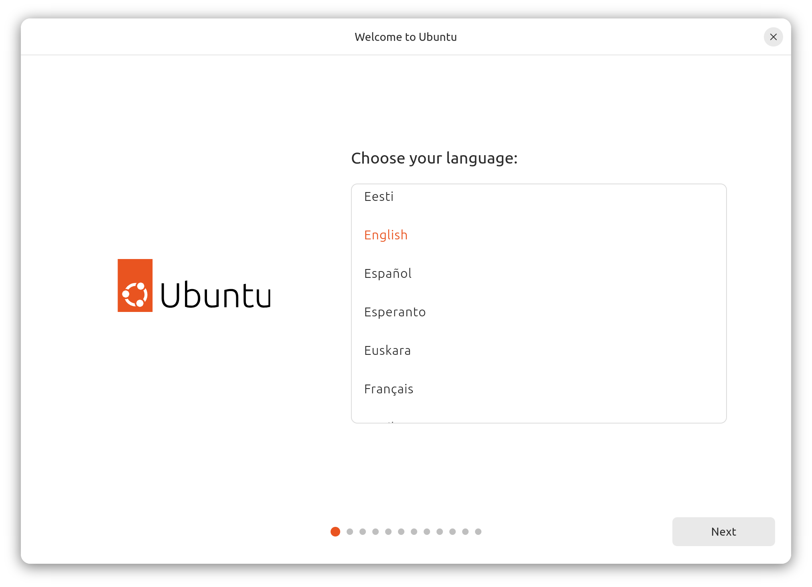

# Operating System (OS)

This guide is oriented towards Ubuntu-based Linux distributions.
However, the guide may be adapted for other distributions.

## Create Bootable USB

### Rufus (Windows)

1. Download and install [Rufus](https://rufus.ie/en/)
2. Download the Ubuntu image file
   ([https://releases.ubuntu.com/](https://releases.ubuntu.com/))
3. Select your :material-usb-flash-drive: USB stick for the Device option
4. Select the :material-ubuntu: Ubuntu image file for the Boot selection option
5. _(optional)_ Disable quick format and/or Enable check device for bad blocks
6. Press the Start button

### Linux

1. Open the Make Startup Disk application
2. Download the Ubuntu image file
   ([https://releases.ubuntu.com/](https://releases.ubuntu.com/))
3. Select the :material-ubuntu: Ubuntu image file for the CD-Drive/Image option
4. Select your :material-usb-flash-drive: USB stick for the Device option
5. Make Startup Disk

## Installation

1. :material-power: Power on or reboot your computer
2. Press **++del++** or **++esc++** key continuously (depends on the computer
   maker) to enter into BIOS menu
3. BIOS Setup :material-arrow-right: Boot :material-arrow-right: Select the
   USB drive as the first boot option
4. Save the changes and exit the boot screen
5. Select _Try or Install Ubuntu_
6. Open the _Install Ubuntu 24.04.2 LTS_ desktop application
    
7. Select the OS language
    
8. Choose your desired accessibility options for Ubuntu
    
9. Select your keyboard layout
    
10. _(optional)_ Setup the Internet connection to update the installer
    
11. _(optional)_ Update the OS installer if needed, and return to step 6
    
    
12. Select _Interactive installation_ for the OS installation type
    
    - Automated installation uses an YAML file for automatic Ubuntu installation
      (see [https://canonical-subiquity.readthedocs-hosted.com/en/latest/reference/autoinstall-reference.html](https://canonical-subiquity.readthedocs-hosted.com/en/latest/reference/autoinstall-reference.html))
13. Use _Default selection_ to just install the essentials, web browser, and
    basic utilities
    
14. Enable _Download and install support for additional media formats_ to
    install media codecs in your OS
    
15. Select _Manual installation_ to create and resize partitions yourself
    
    - Remove all pre-existing partitions in the disk device used for the OS
      installation (`nvme0n1`)
        
    - Select the `nvme0n1` disk device for boot loader installation
        
    - SSD partitions
        - 512MB EFI System Partition

            

        - `/` root (remaining of the disk free available size minus, e.g.,
          16GB for swap area)

            

        - Swap area (~16GB)

            

    - Final partition scheme

        

16. Create your account and setup the computer information settings
    
17. Select your timezone
    
18. Review your installation choices
    
19. Restart the computer when the installation finishes
20. Only remove the installation medium (USB stick) when appearing
    _Please remove the installation medium, then press ENTER_

## Setup

1. Open Settings
    - Task Bar :material-triangle-down: :material-arrow-right:
      :fontawesome-solid-gear: Settings
    - Dock :material-arrow-right: :material-dots-grid: Show Applications
      :material-arrow-right: :fontawesome-solid-gear: Settings
2. :material-lightning-bolt-circle: Power
    - Power: Select _Performance_ (high performance and power usage) mode
    - Power Saving
        - Disable _Dim Screen_ (to avoid reducing the screen brightness)
        - Disable _Screen Blank_ setting it to _Never_ (does not turn off the
          screen upon inactivity)
    - General: Enable _Show Battery Percentage_
3. :material-hand-back-left: Privacy & Security
    - :material-lock: Screen Lock
        - Disable _Blank Screen Delay_ setting it to _Never_
        - Disable _Automatic Screen Lock_ (does not lock the screen after it
          blanks)
        - Disable _Lock Screen Notifications_
4. :material-dock-window: Multitasking
    - Workspaces: Select _Fixed Number of Workspaces_ and set 4 workspaces
    - Multi-Monitor: Select _Workspaces on all displays_
5. :fontawesome-solid-display: Appearance: Select _Dark_ mode
6. :material-monitor-eye: Ubuntu Desktop
    - Desktop Icons: Set _Size_ to _Small_
    - Dock: Set _Icon Size_ to the minimum (occupies less space)
7. :material-keyboard: Keyboard
    - Keyboard Shortcuts:
        - Home folder: **++super+e++**

## Update

```sh
sudo apt update
sudo apt dist-upgrade
```
